# BVHのはなし

[Shinji Ogaki](https://twitter.com/ShinjiOgaki)

これは[レイトレ Advent Calendar 2018](https://qiita.com/advent-calendar/2018/raytracing)の記事です。

最終更新日 24/Dec/2018

## はじめに

今後レイ・トレーシングは専用のハードウェアで行われていくようになるかもしれませんが、使用される基礎的なデータ構造を理解する人・研究をする人が減ってしまうのは残念なので、現在もっとも広く利用されているデータ構造であるBVHについてまとめてみることにしました。大まかなトレンドをつかんでいただければ幸いです。文献の数に圧倒されるかもしれませんが、Light Transportほど込み入った数学が必要ないので勉強は始めやすいのではないかと思います。

## BVHとは?

BVHはBounding Volume Hierarchyの略で、レイ・トレーシングの交差判定や物理シミュレーションの衝突判定の高速化で利用される階層的なデータ構造です。交差判定や当たり判定をするときにシーン内のオブジェクトを総当たりでチェックするわけにはいきませんから、階層的な構造でオブジェクトを扱い、レイが当たらないものをまとめて棄却する、という使い方をします。もちろんフォトンなどを保持するのにも使ってもいいですし、後ほど取り上げますが、最近ではメッシュ・ライトによる照明計算などにも使用されます。

## コスト関数 (Cost Functions)

品質のよいBVHを構築するのはなにかしら品質をはかる尺度が必要になりますが、まずはそこからはじめましょう。

### Surface Area Heuristic (SAH)

[Automatic creation of object hierarchies for ray tracing](https://authors.library.caltech.edu/79167/)

[Heuristics for ray tracing using space subdivision](http://graphicsinterface.org/wp-content/uploads/gi1989-22.pdf)

この記事にたどり着いた人の多くはSAHという用語を聞いたことがあるのではないかと思います。Surface Area Heuristicの略で、レイ・トレーシング用の品質の良いBVHを構築する際の基準として広く用いられています。

SAHはレイの分布がシーン内で完全にランダムであると仮定したときの交差判定にかかる平均的なコストを表したもので、これが小さいほど品質のよいBVHであるといえます。具体的にどう定義されるかを見てみましょう

$$ C_{leaf}(X)=|X| \cdot C_I \\ C_{split}(X, X_0, X_1)=C_T + P(X_0 | X) \cdot C_{leaf}(X_0) + P(X_1 | X) \cdot C_{leaf}(X_1) $$

* $C_I$はプリミティブとの交差判定のコスト
* $|X|$はリーフノード$X$に含まれるプリミティブの数
* $C_{leaf}$はノードに含まれるプリミティブ全てと交差判定を行うコスト
* $C_T$はノードをたどるコスト(メモリ・アクセスとバウンディング・ボックスとの交差判定のコスト)
* $C_{split}$はインナー・ノード(リーフ以外のノード)のコスト
* $P(Y|X)$は条件付確率で、ノード$X$のバウンディング・ボックスにレイが当たり、さらに子ノード$Y$のバウンディング・ボックスにも当たる確率

さて、レイの分布はシーン内で完全にランダムであると仮定したので、$X$の表面積$A(X)$とすると、条件付確率が$P(Y|X)=\frac{A(Y)}{A(X)}$と面積比のみで決められます。そうすると先の再帰的に定義されたコストは次のように展開できます。

$$C(X_{root})=\frac{1}{A(X_{root})} \left( C_T \sum_{N_S}{A(X_{split})} + C_I \sum_{N_L}{A(X_{leaf})} \right)$$

* $X_{root}$はルートノード
* $N_S$はBVH内に含まれるインナー・ノードの数
* $N_L$はBVH内に含まれるリーフ・ノードの数

ここで、リーフにはたった一つのプリミティブが含まれることにします。$K_1$と$K_2$を定数とすると、先の式は$C(X_{root}) = K_1 \sum_{N_S}{A(X_{split})} + K_2$と書き換えることが出来ます。2つの定数はどのようにBVHを構築したとしても変えることが出来ません(実際はOpacityなどが適用されたりするのでプリミティブであっても正確なコストの予測は難しくなります)。すなわち、SAHを最小化することは、全てのインナー・ノードのバウンディング・ボックスの表面積の和を最小化することと等価になります。

分かりにくいと思われた方は、使われている全てのバウンディング・ボックスの表面積の和が小さければ小さいほど良いと覚えておけばよいでしょう。BVHの品質が良い・悪いというのは、SAHが小さい・大きいを意味しています。

後ほど取り上げますが、T-SAHなど時間軸に拡張したものも提案されています。

### End Point Overlap (EPO)

SAHは最もよく使われますが、実際のレイ・トレーシングのパフォーマンスはSAHによって完全に表すことが出来ません。理由はいろいろですが、一つの理由としてノードどうしの重なりが挙げられます。

[On Quality Metrics of Bounding Volume Hierarchies](https://research.nvidia.com/publication/quality-metrics-bounding-volume-hierarchies)

レイの始点あるいは終点が複数のノード内にあった場合には、それらすべてを訪れなければなりません。レイと交差する一番近いプリミティブは大抵、最も近いノード内に含まれますが、そうでない場合もあるので、確認作業が必要となります。

このノードの重なりによる追加分のコストをEPOで表します。

$$EPO= \sum_{n \in N}{C(n) \frac{A((S \setminus Q(n)) \cap n)}{A(S)}}$$

* $S$はシーン中の全ジオメトリ
* $Q(n)$はノード$n$のサブツリーに属するジオメトリ
* $(S \setminus Q(n)) \cap n$は$n$のサブツリーには属さないが、$n$のバウンディング・ボックス内にあるジオメトリ

EPOを加味したコストはSAHとの線形和$(1-\alpha) SAH + \alpha EPO,\ 0 \leq \alpha \leq 1$となりますが、残念ながら$\alpha$はシーンに大きく依存します。また構築や最適化においてこれらのEPOを正確に見積もるのはコスト的に現実的ではないため、依然としてSAHが使われます。

### Surface Area Orientation Heuristic (SAOH)

メニー・ライトは最近ホットな話題です。メッシュ・ライトによる照明計算を高速化するためにもBVHが使用されます。

[Importance Sampling of Many Lights With Adaptive Tree Splitting](https://www.highperformancegraphics.org/wp-content/uploads/2018/Papers-Session1/HPG2018_ImportanceSamplingManyLights.pdf) [(Slides)](https://www.highperformancegraphics.org/wp-content/uploads/2018/Papers-Session1/HPG2018_ImportanceSamplingManyLights.pdf)

この論文ではSAOHと呼ばれる尺度を導入して、照明計算に特化したBVHを構築する方法が述べられています。名前のとおり、面の向きを考慮に入れてオブジェクトをグループに分けます。同じ向きに向いているポリゴンをまとめたほうが照明計算には都合がよさそうというのは直感的に分かりますね。

あるポリゴンが選択される確率(PDF)はBVHをトラバースしながら求めます。またMultiple Importance Samplingでレイが当たったポリゴンのPDFを求める必要があるため、BVHのノードに空きがあれば親のノードへの参照をストアしておくとよいでしょう。Refittingの並列化や最適化にも使えて便利です。

実際はBVHの深さと同じ長さのビット配列がリーフにストアされていれば親ノードへの参照は必要はありません。興味がある人は考えてみてください。

## 構築 (Construction)

構築方法はおおまかにトップダウン型とボトムアップ型に分かれます。

### トップダウン型 (Divisive)

現在の主流のトップダウン型では、与えられたプリミティブ全てをまず2つのグループに分け、それぞれのグループをさらに2つに分ける、という手順で構築します。この分割はグループに含まれるプリミティブの数が決められた数以下になるまで再帰的に行われます。

オブジェクトをグループに分ける方法は主に2通りあります。一つはObject Splittingと呼ばれるもので、もう一つはSpatial Splittingと呼ばれるものです。双方に長所と短所があります。

#### オブジェクト分割 (Object Splitting)

こちらは重複を許さずにオブジェクトをグループに分ける方法です。プリミティブは必ず右か左の子ノードどちらかに属します。また、重複を許さないためBVHで使用されるノードの数が事前に予測できメモリの管理が簡単です。$N$個のリーフがあった場合、ノードは最大でも$N-1$個となります。また、モーション・ブラーの実装が楽になるというメリットがあります。

グループに分ける際はSAHが最も小さくなるような分け方をしますが、$N$個のプリミティブを２つのグループに分ける組み合わせをすべて試すのは現実的ではありません。一般的には次にあげる２つの方法が使われます。

* **Sweep**
全てのプリミティブの中心座標を分割したい軸方向にソートし、全てを走査して、コストが最小となる分割位置を探します。

* **Binning**
近似方法ですがSweepで分割した場合と遜色ないBVHを高速に作ることが出来ます。バウンディングボックスを分割したい軸方向に、例えば8や16といった限られた数に分割し、各領域(これをビンと呼びます)に入るプリミティブを数え、表面積を考慮し、どこで分割するかを決めます。プリミティブがどのビンに入るか判定する際にはプリミティブのバウンディング・ボックスの中心座標を使います。

トップダウン型で構築を行う場合のTask Queueのサンプル・コードは[こちら](https://github.com/shinjiogaki/bvh/blob/master/taskqueue.cpp)に置いてあります。

#### 空間分割 (Spatial Splitting)

こちらは重複を許してグループ分けするもので、大きなポリゴンなどを分割して(切断すると考えてよいでしょう)ぴったりとしたバウンディング・ボックスを作ることができるため、交差判定は非常に高速になります。切断されたプリミティブは、2つの子ノード両方に含まれることになるのでBVHのノード数は事前に予測することはできません。kd-treeも同様に空間を切断するので、レイ・トレーシングの速度は変わらないのではと思うかもしれませんが、SplitありのBVHは、何もない空間を一気にスキップすることができるという点で有利です。

[Spatial Splits in Bounding Volume Hierarchies](https://www.nvidia.com/docs/IO/77714/sbvh.pdf)

[Parallel Spatial Splits in Bounding Volume Hierarchies](http://rapt.technology/data/pssbvh.pdf)

Spatial Splitsを用いたBVHの構築を並列で高速に行う方法です。複数スレッドの管理が鍵となります。ルートに近いノードでパーティションを行うときは、複数のスレッドが協力して行います。ある程度細かくパーティションがなされたあとは、一つのスレッドがサブツリーの構築を行います。他にもSIMDを用いた高速化などが記述されています。

[Manuka: A batch-shading architecture for spectral path tracing in movie production](https://jo.dreggn.org/home/2018_manuka.pdf)

[Splitting bounding volumes of primitives (US20140362074A1)](https://patents.google.com/patent/US20140362074A1/en)

空間分割を用いると、モーション・ブラーの取り扱いと構築は共に複雑になります。入力されるオブジェクトが均等に細かく分割されている場合(映画のアセットなどはディスプレイスメント・マップやサブディビジョン・サーフェスによってメッシュが細かく分割されていることが多い)はメリットがほとんどありません。

### ボトムアップ型 (Agglomerative)

トップダウン型と異なり、プリミティブのペアを作り、さらに出来上がったペアのペアを作る、といったアプローチでBVHを構築します。

[Fast Agglomerative Clustering for Rendering](https://www.cs.cornell.edu/~kb/publications/IRT08.pdf)

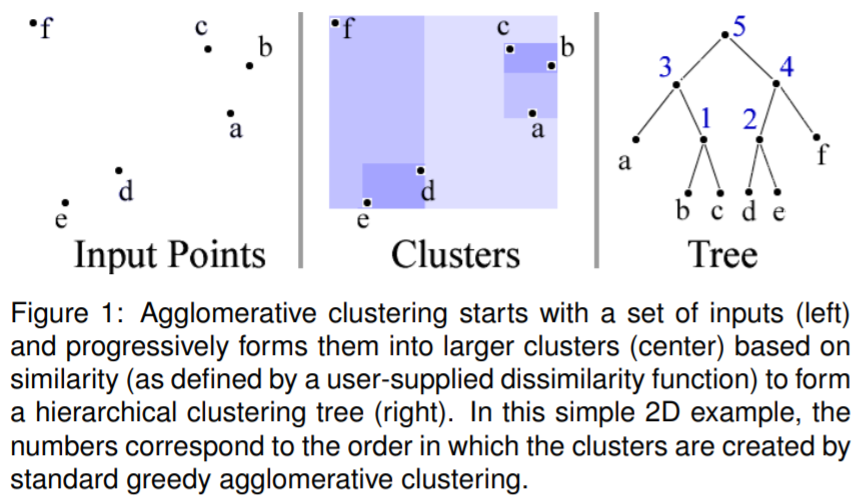

初めてボトムアップ型の構築を導入した論文ですが、品質の良いBVHが作れる反面、ペアを見つけるのに別のデータ構造を用いているため、実際の使い勝手は良くありません。ただし手法自体は有益で、後述するツリーレットの最適化手法でも使用されます。

[Efficient BVH Construction via Approximate Agglomerative Clustering](http://graphics.cs.cmu.edu/projects/aac/) [(Slides)](http://www.highperformancegraphics.org/wp-content/uploads/Gu-AAC.pdf)

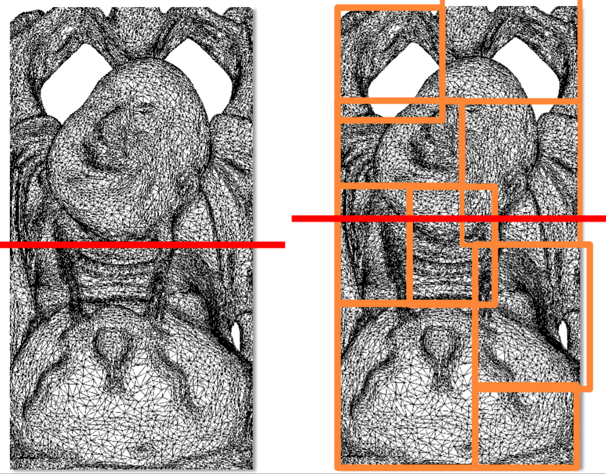

Agglomerative Clusteringは図のように細かく分割されたモデルの場合、品質の悪いBVHを生成します。これはバウンディング・ボックスの重なりが大きくなるためで、解決するにはEPOといった別の評価関数を取り入れる必要があります。Manukaのように全てのオブジェクトを細かく分割するタイプの実装では、そのままAgglomerative Clusteringを使うのはお勧めしません。

[Parallel Locally-Ordered Clustering for Bounding Volume Hierarchy Construction](https://dcgi.felk.cvut.cz/projects/ploc/ploc-tvcg.pdf)

構築の並列性が高くないというAACの問題を克服しています。アルゴリズムは非常に簡単で、まず$N$個のプリミティブが与えられたとき、各プリミティブにつき1つのクラスタ、つまり全部で$N$個のクラスタを用意します。次にこれらをモートン・コードでソートします。ソートは最初に一度だけ行われます。

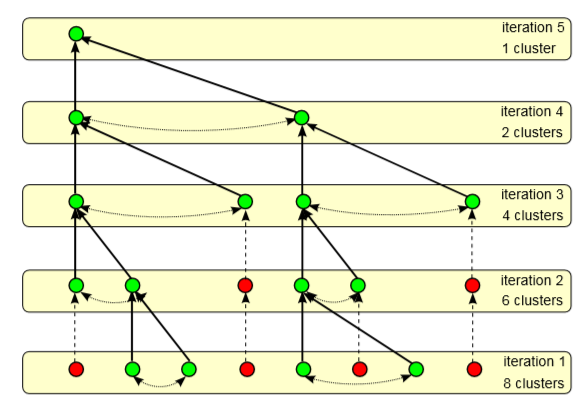

つづいて、それぞれのクラスタに対して、自身のインデックス$-r$から$+r$の範囲から最も近いクラスタを探します。全てのクラスタについて最も近いクラスタが見つかったら、最近傍ペアを作ります(図の緑のクラスタ)。最近傍ペアというのはクラスタ$C_i$と$C_j$があった時に、$C_i$が$C_j$の最近傍かつ$C_j$が$C_i$の最近傍であるようなペアのことをいいます。

次に見つかったペアをマージします。ペアが見つからなかった場合(図の赤のクラスタ)はそのクラスタはそのまま残します。この処理を繰り返し、クラスタが一つになるまで繰り返して、BVHの構築が終了します。これらの処理はダブル・バッファを用いて並列で行うことが出来ます。

個人的には実装しないと思っていたので、きちんと読んでいませんでしたが、分かり易く書かれた良い論文です。アルゴリズムが必ず収束する(各反復で必ずペアが見つかる)のを証明している部分がありますが、簡単なグラフ理論を使ってきれいに書かれています。

論文中ではATRBVHより高速にレンダリングできるシーンが多いものの、Happy Buddhaではやはり遅くなると報告されています。

`PLOCの論文ではイントロダクションでインサーションも一般的な構築方法の一つだと書いてありますが、個人的にはインサーションは最適化手法に分類するのがふさわしいと思うので最適化のReinsertionのところで紹介します。`

### リニアBVH (LBVH)

LBVHは少し分類に迷ったので、独立したカテゴリとすることにします。

[Fast BVH Construction on GPUs](http://graphics.snu.ac.kr/class/graphics2011/references/2007_lauterbach.pdf)

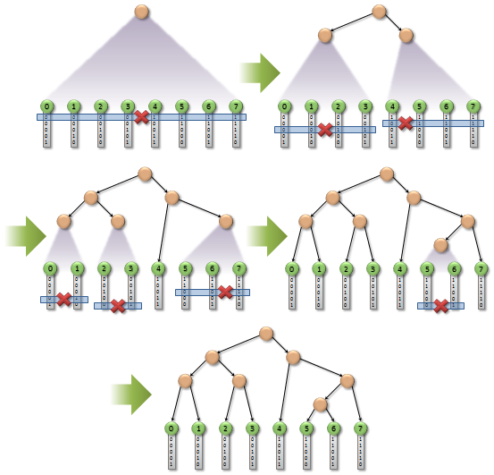

image from https://devblogs.nvidia.com/thinking-parallel-part-iii-tree-construction-gpu/

この論文はLBVHを導入した論文として知られていますが、実は内容は2部構成で、前半がモートン・コードといった空間充填曲線を利用する高速な構築方法の提案、後半がBinningを使ったSAHを最小化する構築の並列化についての解説となっています。

前半部分ですが、シーンをグリッドに細かく分割し(明示的に行うのではなく、モートン・コードなどの空間充填曲線により得られるコードにより陰に行われます)、各オブジェクトが所属するグリッドのIDを空間充填曲線によって求めます。その値が近いもの同士がペアとなります。高速ですが、品質はあまりよくありません。特に局所的にポリゴン数の多いオブジェクトがあるケース(いわゆるteapot in stadium)を苦手とします。

構築はトップダウンかつ逐次型で、まずプリミティブをコードでソートし、ルート・ノードを用意します。そして最上位ビットが変わる部分を見つけ、子ノードを2つ生成します。1つは最上位ビットが0であるプリミティブ用、もう1つは最上位ビットが1であるプリミティブ用です。つづいて、それぞれの子ノードに属するプリミティブに対し同様の処理を行うのですが、次は上から2番目のビットの値が変わる場所(なければ3番目のビット)を見つけ、それぞれのノードにさらに子ノードを2つ追加します。子ノードに属すプリミティブが1つになればそれはリーフであり、そのグループについての処理は終了します。

後半のSAHをつかったBVHの構築はいたって普通で、Binningを使ったものとなっています。一般的に、ルート・ノード付近での並列性を高めるのは難しいことから、ハイブリッドな構築手法も提案しています。ルートに近い部分のみLBVHで構築し、残りはBinningを使うというものです。並列性を上げることは出来ますが、ルートに近い部分のノードは一般的に表面積が大きいため、出来上がったツリーの品質についてはあまり期待できません。

[HLBVH: Hierarchical LBVH Construction for Real-Time Ray Tracing](https://research.nvidia.com/publication/hlbvh-hierarchical-lbvh-construction-real-time-ray-tracing)

LBVHの構築はメモリを多く消費してしまうといった欠点がありましたが、上位レベルのツリーと下位レベルのサブツリーとの2段階でBVHを構築することで解決しています。

[Simpler and Faster HLBVH with Work Queues](https://research.nvidia.com/publication/simpler-and-faster-hlbvh-work-queues)

タスク・キューを用い上記のHLBVHの構築方法を簡潔、かつ高速にしています。

[Maximizing Parallelism in the Construction of BVHs, Octrees, and k-d Trees](https://research.nvidia.com/publication/maximizing-parallelism-construction-bvhs-octrees-and-k-d-trees)

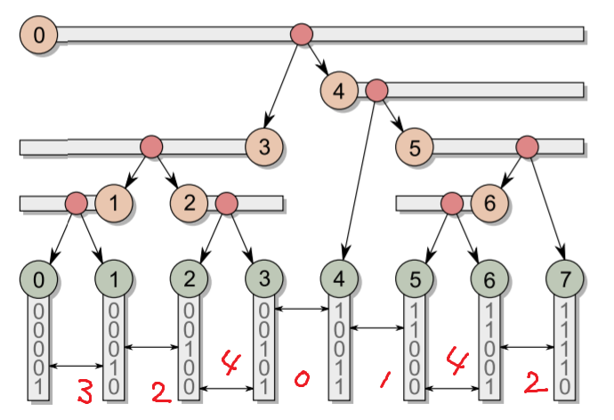

先に挙げた2つの論文では、メモリ消費、並列性などLBVHの構築方法の欠点がいくらか解決されたものの、依然としてノードの処理は完全に並列ではありませんでした。この論文では全ノードを並列に扱う方法が提案されており、また、応用範囲は広くOctreeなどにも適用できます。

構築されるBVHは上図のようなノード(ピンク)とリーフ(グリーン)のレイアウトとなります。アルゴリズムは単純で、それぞれのノードについて独立に、「ノードがカバーする範囲(図中の水平なバー、文献によってはPivotsと書いているものもある)」と「Split(つまり分割位置)」を求めます。BVHの構築にはSplit(言い換えれば子ノードへの参照)だけ分かればよいのですが、ノードがカバーする範囲はSplitを見つけるために使われます。

分かり易くするため、まず、ノード3に注目してみましょう。対応するリーフのコードは$00101$、右隣のノード4に対応するコードは$10011$、左隣のノード2に対応するコードは$00100$となっています。

ここで$\delta(i,j)$を「ノード$i$と$j$のコードの共通な上位ビットの数」としましょう。赤い手書き文字で書かれた数字です。最上位ビットが異なるので、$\delta(3,4)=0$、$\delta(3,2)=4$であるので、$\delta(3,4)-\delta(3,2)=-4<0$となります。この値がマイナスであった場合は、リーフ3はこのノードの先頭(左端)ではなく、末尾(右端)であることが分かります。逆に、$0 \leq \delta(i,i+1)-\delta(i,i-1)$の時はこのノードがカバーする範囲の先頭となります。ノード5を見ればこの値は$4-1=3$となっています。

同様にコードを調べ、逆の端点、つまり対象ノードが末尾であった場合は先頭を、先頭であった場合は末尾を探します。ノード3は末尾であるので、左方向に探索を行います。探し方は特殊で、まず進む方向と逆の右隣を見て、$\delta(3,4)$を求めます。$0$ですね。$0<\delta(3,j)$である間、左へ進んでいき、結果$j=0$となります。ノード5の場合は先頭であるので、右へ進んでいきます。同様にまず逆の左隣をみて$\delta(5,4)$を求めます。$1$ですね。$1<\delta(5,j)$である間、右へ進みます。結果$j=7$となります

つづいてSplitを探します。ノード3の場合は$\delta(3,0)=2$なので$\delta$が$2$からそれより大きな値へ変化するところつまり2と1の間がSplitとなります。ノード5の場合は$\delta(5,7)=2$で、同様に$2$から大きな値に変化する場所つまり6と7の間がSplitとなります。探索には二分探索などが使えます。

以上のように、各ノードが完全に独立して子ノードへの参照を求めることができるという素晴らしい手法です。

[Thinking Parallel, Part III](https://devblogs.nvidia.com/thinking-parallel-part-iii-tree-construction-gpu/)

著者によるブログでも解説されています。

[Extended Morton Codes for High Performance Bounding Volume Hierarchy Construction](http://dcgi.felk.cvut.cz/projects/emc/)

LBVHが苦手とするteapot in stadium問題に対する対策を含め、いくつかの改善策が書かれています。

モートン・コードはX($x_3 x_2 x_1 x_0$)、Y($y_3 y_2 y_1 y_0$)、Z($z_3 z_2 z_1 z_0$)の正規化した各座標のビットを$x_3 y_3 z_3 x_2 y_2 z_2 x_1 y_1 z_1 x_0 y_0 z_0$のように順番にならべたものです。(簡単のため4ビットで各座標を表現しています。)

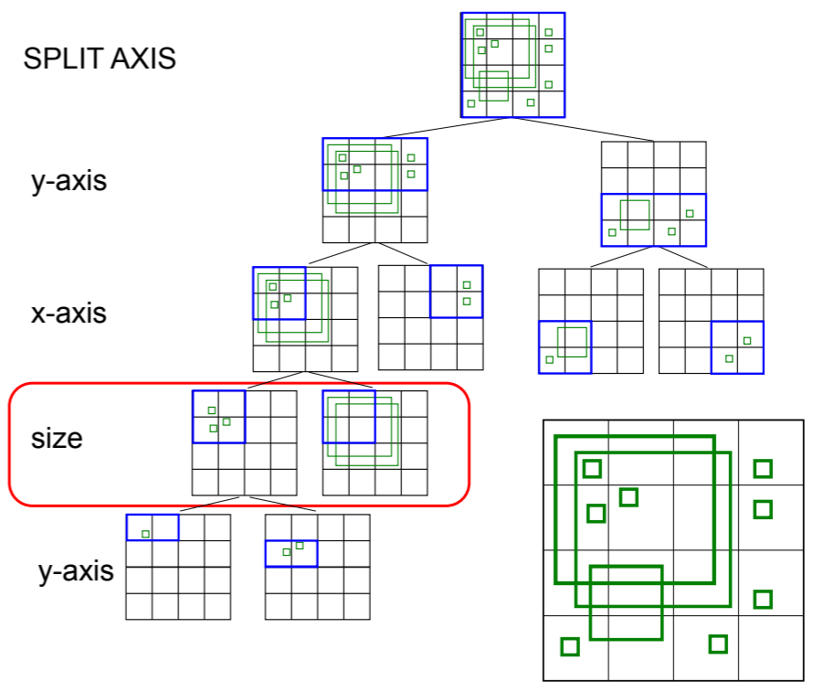

BVH構築時にプリミティブのサイズを考慮するため、その中心座標だけではなく、バウンディング・ボックスの対角線の長さS($s_3 s_2 s_1 s_0$)もモートン・コードに組み込み、$x_3 y_3 z_3 s_3 x_2 y_2 z_2 s_2 x_1 y_1 z_1 s_1 x_0 y_0 z_0 s_0$のように拡張しています。

大きなプリミティブはルートからリーフ・ノードまでのパス上にあるすべてのノードのサイズを大きくしてしまうため、小さなプリミティブと大きなプリミティブは中心座標が近くても、別のグループに分けたほうが、交差判定の効率が上がります。ただし、グループ分けを行うのがルートに近すぎても、リーフに近すぎても、ノードの重なりによって、逆にBVHの品質が下がってしまいます。この論文では、1となったサイズ・ビットが示す長さがバウンディング・ボックスのサイズより大きい場合、別のグループに分けることとしています。

また、サイズのビットは必ずしもインターリーブにする必要はなく、数も可変にして、$xyzxyzsxyzxyzs$のように座標へより多くのビットを割り当てることができます。また$yxyxzsyxyxzs$のように長軸を優先したり、シーンの広がりによってビット数を可変に割り当てたりすることで単純なモートン・コードの使用に比べBVHの大幅な品質改善を達成しています。

提案手法はモートン・コードを利用する構築方法全てで利用可能です。

### 盆栽 (Bonsai)

ミニ・ツリーという小さなツリーを大量に並列で構築し、それらをさらにまとめて1つのBVHを構築する方法もあります。

[Bonsai: Rapid Bounding Volume Hierarchy Generation using Mini Trees](http://jcgt.org/published/0004/03/02/paper.pdf)

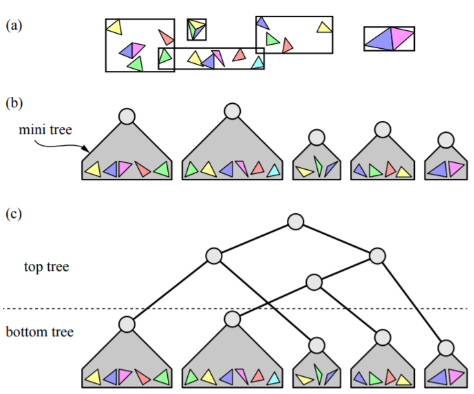

ミニ・ツリーをたくさん構築して、さらに、個々のミニ・ツリーをリーフとみなし、BVHを構築しますが、そのままでは質のいいBVHが作れるとは限りません。ミニ・ツリーのルートのバウンディングボックスが大きい場合は、刈込み(Pruning)を行います。刈込みとは、ルートに近いノードをばらし、ミニ・ツリーをさらにいくつかのミニ・ツリーに分ける操作で、それらから再び一つのBVHを構築します。これが盆栽（Bonsai)と名づけられた所以です。

侮るなかれ。この刈込みは様々なプリミティブに対してBVHを構築し、それらを1つのBVHにまとめる時の有力な手段となりますし、同じような考え方はRe-braidingの論文でも用いられています。

## 分割統治法 (DACRT)

構築方法について述べましたので、構築しない方法についても触れたいと思います。日本語にすると分割統治法(Divide and Conquer Ray Tracing, DACRT)と呼ばれるアプローチで入力データを小さなグループに分割し、そのグループ内で総当たりの交差判定を行います。構築とトラバースを同時に行い、構築したBVHを保存しないのが特徴で、動的なシーンのレンダリングに適しています。

プリミティブの陰的なデータ構造にはBVH、Octree、kd-treeなど任意なものを用いることが出来て、それらの長所と短所をそのまま継承します。またレイの分割にも4次元のLight Fieldを用いることができるなど、自由度は大変高いです。また、グループ分けをイン・プレイスで行った場合、事前に消費メモリのサイズが分かるため、ハードウェアの実装に適しています。

プリミティブやレイのデータは大きくなりがちなので、グループ分けでそれらを移動させるのは非効率的です。ですので、それらのインデックスの配列を作り、インデックスだけを移動させるという方法をとります。したがって、1つのプリミティブとレイにつきそれぞれ、4バイト(int型の場合)の追加データが必要となります。

学術的には大変面白い手法ですが、プロダクション・レンダラでの採用が進まないのには理由があります。この方法ではパフォーマンスを上げるため、あるいは構築分のコストを償却するため同時に多くのレイ扱いますが、プロダクション・レンダラでは1つのレイに非常に多くの情報(レイ微分、QMCなどサンプルに関連する情報、反射回数などなど)が付随します。よって、生存期間が重なるレイが増えると、メモリの消費が膨大になってしまうというジレンマに陥ります。また、並列化されたアルゴリズムも提案されていますが、スレッド数に比例させて高速化するのも難しいようです。また、パス・トレーシングはWavefront方式に切り替える必要があります。

このアプローチのメリットはダイナミックなシーンが簡単に扱えることですが、複数種類のプリミティブを同時に容易に扱えるのも利点です。プリミティブの種類ごとにBVHを構築しストアしておく必要がありません。

DACRTをテーマにした論文にはどれも簡単に見つけられる(あるいは改善できる)欠点があり、突き詰めたものが存在しないという印象を受けます。逆に、論文を書くには大変良いテーマなのではないでしょうか。もちろん、プロダクションで使えるレベルに昇華させるのは全く別の問題です。

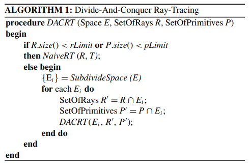

アルゴリズムは上のコードのようにシンプルです。まず、シーンを含むバウンディング・ボックス、プリミティブのリスト、それからレイのリストを入力し、プリミティブを何らかの基準によって2つのグループに分けます。一番単純な方法は、長軸でバウンディング・ボックスを2つに切断し、そのどちらかに含まれるかによって分類するものです。レイも同様に、左の子ノードにヒットするもの、右の子ノードにヒットするもの、といった具合に分類します。グループに分ける処理は一般的にフィルタリングと呼ばれます。フィルタリングを終えると、2つの子ノード、2つのプリミティブのリスト、2つのレイのリストができるので、それらに対しさらに同様の処理を行い、レイのリストのサイズとプリミティブのリストのサイズが共にある程度小さくなったら、総当たりの交差判定を行います。

フィルタリングは陰に使用するデータ構造やアルゴリズムにより異なり、右のノードにヒットするもの、左のノードにヒットするもの、それから両方のノードにヒットするものといった具合に2つ以上のグループに分けることもあります。

[Naive ray-tracing: A divide-and-conquer approach](https://dl.acm.org/citation.cfm?id=2019636)

DACRTを提案した論文です。2009年にmental imagesよる特許で同様の内容が記述されていたようです。

高速化手法としてConic Packet(円錐を使ったバンドルによるDACRT)が用いられています。これはレイの始点が同じである場合、1次レイやシャドウ・レイの計算に用いられています。

分割はイン・プレイスであると書かれているので、陰に使われるデータ構造はObject SplittingのBVHだと思っていたのですが、実はkd-treeが用いられています。イン・プレイスで実装するため、フィルタリングは、左のノードと交差するものとそうでないものを分けるパス、右のノードと交差するものとそうでないものを分けるパスの2回行われており、ここが欠点と考えられます。分割は長軸で行います。その位置は、10000以上プリミティブがある場合、間引いたプリミティブで近似したSAHをもとに決定され、10000より少ない場合は単純に真ん中とします。

`kd-treeはトラバースが高速であると考えられますが、kd-treeでフィルタリングを2回行うのと、Object Splittingでフィルタリングを1度だけ行うのとどちらが実際に高速か検証する必要がありそうです。`

残念ながら、並列化については詳細がいっさい書かれていませんが、実は2011年のi7、4コア8スレッドのCPUを用いたパス・トレーシングで4.6Mrays/sec(Sponza、7回の拡散反射)となかなか素晴らしい結果を達成しています。この数値は1スレッドの時の4.2倍であり、線形に近い高速化が達成できています。後ほど2本、並列化を扱った論文を取り上げますが、この論文の実装のほうがより優れていたように思えます。内容もしっかりしており、DACRTに興味がある方は、まずこの論文を読むとよいと思います。

[Efficient Divide-And-Conquer Ray Tracing using Ray Sampling](http://www.wakayama-u.ac.jp/~iwasaki/project/dacrt/hpg2013final.pdf)

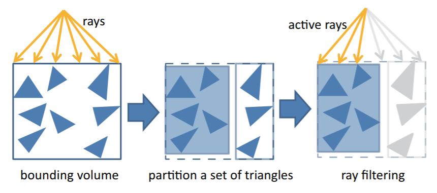

この論文では陰的なデータ構造にBVHを利用しており、プリミティブは、コスト関数にSAHを用いて、Binningを用いて2つのグループに分けられます。ただし、コストの計算では単純に親ノードと子ノードの面積比を用いず、無作為に選ばれた一部のレイ(Representative Rays)を用いて、レイが子ノードにあたる確率を近似しています。こうすることで、実際のシーン中のレイの分布が考慮されるため、交差判定の高速化が期待できます。レイに相関がある場合効果が大きそうです。

プリミティブをグループ分けした後、レイを「左のノードに当たるもの」と「右のノードに当たるもの」の2つのグループに分けるフィルタリングの処理を行います。フィルタリング後、トラバースを行いますが、サンプルされたレイの過半数が左のノードに当たる場合は左のノードを先に、過半数が右のノードに当たる場合は右のノードを先に、トラバースします。

理にかなったように見えますが、実はここがこの論文の欠点となっています。例えばレイのバッチ・サイズが100本であった場合、51本が右、49本が左のノードが近いといった状況であれば、右のノードを先にトラバース(再帰的にDACRT)するわけですが、本来左のノードを先にトラバースすべきレイは、右のノードを先にたどらざるを得なくなります。したがって、本来テストしなくてよかったプリミティブとの交差判定を行う必要が出てきます。民主主義的にトラバースの順番を決めているので、処理は全てのレイについて最適ではありません。ただし、これは数行のコードの追加で修正できますので、それほど大きな問題ではありません。また、レイがどちらか一方のノードのみとしか交差しないという状況であれば、この問題は無視できます。

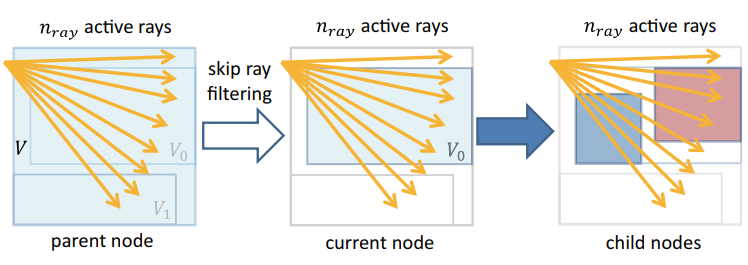

Representative Raysに基づいた確率計算の他に、この論文には、レイのフィルタリングをスキップするというユニークなアイデアが導入されています。レイのフィルタリングはアクティブなレイの数を減らすのに役立ちますが、レイの原点や向き、ノードの位置によってはフィルタリングしてもアクティブなレイがほとんど減らないことがあります。そういった場合はフィルタリング自体をスキップしたほうが効率的です。

また、残念ながらこの方法は並列化が考慮されていません。

[Parallel Divide and Conquer Ray Tracing](https://www.cs.dartmouth.edu/~sriravic/papers/pdacrt.pdf)

この論文では、DACRTを並列化することにのみ焦点を当てています。ルート・ノードとプリミティブとレイのリストから処理を始めるのは共通ですが、出来上がった子ノードを再帰による深さ優先の処理ではなく、幅優先で並列に処理していきます。

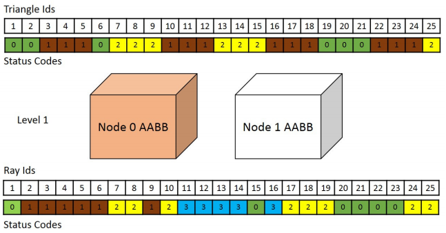

それぞれのノードにおいて、バウンディング・ボックスを２つに分割したのち、プリミティブ(ここではTriangle)を3つのグループに分けます。Node0にのみ含まれるもの、Node1にのみ含まれるもの、両方をまたぐもの、の3つです。レイは4つにグループ分けされます。Node0あるいはNode1にのみヒットするもの、両方にヒットするもの、それから、どちらにもヒットしないものです。

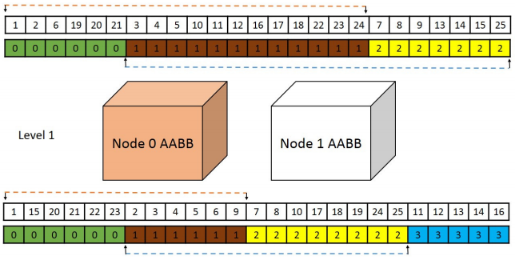

次にそれぞれのリストをグループによってソートします。どちらにもヒットしなかったレイは、除去されます。深さを一つ進めるには、レイとプリミティブのリストを作り直します。上の図の例でいうと、Triangle Idsは1,2,6～24までと3,4,5～25までのリストの2つをくっつけたものが新たに生成され、現在のリストは破棄されます。レイのリストも同様に1～9までのリストと2～25までのリストの2つをくっつけたものが新たに生成されますが、レイのリストの場合は、最近傍点を見つけたり、子ノードにヒットしないなどで、一般的にサイズが小さくなっていくのでメモリ消費の問題は深刻ではありません。

実は、陰に利用されるデータ構造には、BVHではなくkd-treeが用いられています。kd-treeを用いた理由は高速化のためであると思われます。しかし、kd-treeを用いたが故、プリミティブのグループ分けがObject SplittingのBVHとは異なり、イン・プレイスで出来なくなってしまい、深いレベルにいくにつれてプリミティブの参照が重複し増えていきます。論文中でもこれは欠点として触れられており、DACRTは本来省メモリが売りであるにも関わらず、子ノードをまたぐプリミティブの参照によってメモリの消費が膨大になってしまうというジレンマに陥っています。

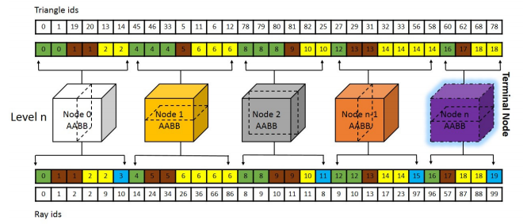

さて、先述の通り、レイのグループとプリミティブのグループが十分に小さくなったら総当たりの交差判定を行うのですが、この処理も並列化されています。閾値サイズ以下になったレイとプリミティブのグループ(あるいは、ターミナル・ノードに所属するといいます)は事前に確保されたバッファへとコピーされます(上図)。バッファがいっぱいになれば、各ノード内においてレイとプリミティブの交差判定を行います。すべてのノードは並列に処理されます。それぞれのレイは最近傍点までの距離とヒットしたオブジェクトのIDを持ちますが、それらはmin_tバッファ、hit_idバッファとしてグローバルに確保された配列にストアされます。バッファがいっぱいになるまでこの処理は行われないので、それまでは最近傍点までの距離が更新されず、無駄な交差判定が行われることになります。

また、幅優先で処理する代償として、front-to-backトラバーサルをあきらめています。右、あるいは左のノードがレイの原点から近い、といった情報は一切使用せず、基本的にはどちらもチェックするという非常に効率の悪いアルゴリズムが用いられています。

構築の手法の解説で触れたように、ルート・ノード近くは並列性を高めるのが難しく、また非常に効率の悪いトラバースを行うので、GPUを用いたにもかかわらず、大した高速化が出来ていません。並列化しただけという内容の論文ですが、逆に並列化の難しさを伝えるという役割を果たしているように思います。

[Improving Divide-and-Conquer Ray-Tracing Using a Parallel Approach](https://ieeexplore.ieee.org/document/6915284)

こちらも並列化をテーマにした論文ですが、Parallel DACRTと比べていくつか工夫がされています。

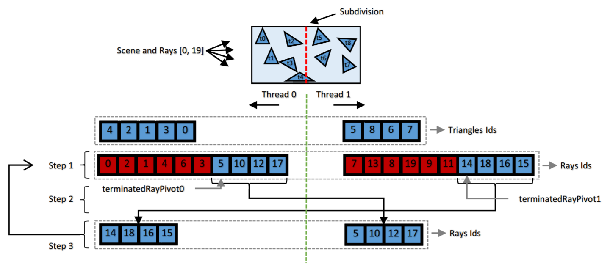

この論文ではレイとプリミティブをスレッド数に応じて複数のグループに分け、各スレッドが１つのレイのグループと１つのプリミティブのグループの交差判定を行います。もちろんこれだけでは各レイが最近傍点を見つけることができませんので、レイのグループは別のプリミティブのグループと交差判定を行う必要があります。もっとも単純なケースでは、上図のようにそれぞれ２つのグループがある場合で、レイのグループを単純にスワップさせればよいことがわかります。

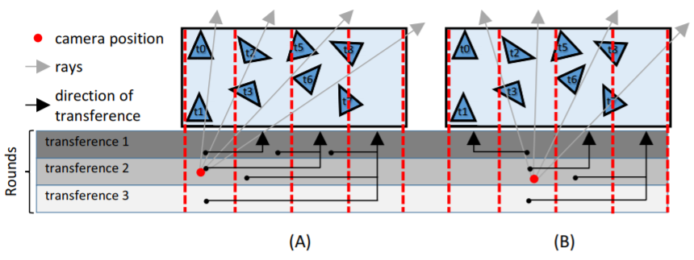

スレッド数が増えるにつれ、レイとプリミティブのグループの数は増えていきます。ですのでノードが2つだけであればレイのグループをスワップさせればよかったのですが、複数ある場合は上図のようにレイのグループをまだ交差判定を行っていないプリミティブのグループのほうへ移していく必要があります。この移す順番と開始点はレイの始点と方向に依存します。当然ながら近いプリミティブのグループから処理したほうが効率が良いわけですが、処理開始時点での最適なレイとプリミティブのグループのペアを何かしらのコスト関数を最小化するように決めるのはなかなか難しいのではないでしょうか。

面白い方法ですが、パフォーマンスはスレッド数に比例しておらず、改善の余地があることを示唆しています。

## 最適化 (Optimization)

ここから最適化の話に入ります。最適化手法にはBVHのトポロジーを変更するもの、またノードの並びを変更するもの、メモリの節約を行うものなど、様々なものがあります。

BVHの品質を上げる最適化は、SAHのみを考慮するもの、それからRepresentative Raysと呼ばれるレイを投げ、シーン内での実際のレイの分布を考慮に入れるものの2つに分けることが出来ます。後者のタイプではどのレイが、どのノードに当たったか、どのリーフに当たったか、といった記録を取る必要があるので追加のコストが必要になりますが、レンダリングするシーンに最適な結果を導き出すことができます。コンパイラのProfile Guided Optimizationと似たコンセプトです。Representative Raysは実際のレンダリングに使われるレイの一部（数パーセント）であるためオーバーヘッドは小さく、また、それによって得られた結果は無駄にはなりません。

トポロジーを変更する最適化は、静的なシーン用のBVH構築直後、または、動的なシーンでBVHの品質が下がっていくのを防ぐ為にプログレッシブに行います。

### Wide BVH (N-ary BVH)

現在主に使われているIntelやAMDのCPUはSIMDといわれる４から16の演算を並列に実行するユニットが備わっていますので、CPUの実装ではWide BVHが使われることがほとんどです。SSE、AVX、AVX-512といったユニットを聞いたことがあるでしょうか？Wide BVHはそれらを活用し、複数のバウンディング・ボックスとレイの交差判定を一度に行えるようにするため提案されました。各ノードは複数の子ノードを持つことになり、これがWide BVHと呼ばれる所以です。通常実装にはSOA(Structure of Arrays)を使います。複数のバウンディング・ボックスのデータが隣接するのでメモリのアクセスの点で有利です。1つのノード自体は大きくなりますが、ノードの数自体が減るので、メモリ消費の観点からは64ビット消費するポインタではなく32ビットのインデックスで管理したほうが良いでしょう。

`少し話がそれますが、これに限らずポインタの使用はお勧めしません。integerのインデックスでよい場合はインデックスを使うように心がけましょう。インデックスが妥当かどうかは値が-1(あるいは最大値)かどうかでチェックします。ポインタでもnullかどうかで判別できるから同じだと思うかもしれませんが、それは早とちりです。インデックスの利点は配列のサイズが分かっていた場合、値の上限についてもチェックできるという点で、バグが発見しやすくなります。個人的にはメモリ節約よりもこれによる恩恵のほうが大きいと感じています。私が作っているレンダラはインデックスに切り替えてからクラッシュ・バグと戦うことがほぼなくなりました。自分の経験では、製品でもクラッシュするバグはだいたいポインタがらみです。`

[並列演算に適したバウンディングボリューム階層によるレイトレーシングの高速化](https://dspace.jaist.ac.jp/dspace/bitstream/10119/3530/2/091paper.pdf)

QBVHと呼ばれているものです。SSEを用いており、BVHは４分木となります。QBVHを解説した英語の文献は、次にあげるものが最初で、現在はそちらが広く知れ渡っています。英語で書くことの大切さを思い知らされます。

[Shallow Bounding Volume Hierarchies for Fast SIMD Ray Tracing of Incoherent Rays](https://www.uni-ulm.de/fileadmin/website_uni_ulm/iui.inst.100/institut/Papers/QBVH.pdf)

QBVHについては日本語のを読んだからこちらは読まなくてもよいと思うかもしれませんが、この論文ではさらにShadow Rayの高速化について触れていますので一読の価値ありです。基本的には、あるノードからトラバースを開始してヒットしなければ親ノードに戻る、ということを行いますが、親へ戻ってトラバースするには、親ノードへの参照が必要になること、またSIMDの幅がNであった場合に、そのうちの一つは既に計算済みですから、使用率が100%ではなく$\frac{N-1}{N}$になってしまうという欠点があります。

レイの始点と終点がいつも特定のノードに収まる場合には、ルート・ノードからトラバースせず、特定のノード以下(サブツリー)だけ対象にすればよいので、高速化が可能です。この場合は親ノードへの参照も必要ありませんし、SIMDの使用率も落ちません。また、始点が含まれるルート以外のノードからトラバースを開始して、何もヒットしなかったら改めてルートからルートからたどる、ということも可能です。こういったテクニックの使いどころは、近年はやりのランダム・ウォークを使ったサブサーフェス・スキャッタリングや(MFPによりある程度範囲が絞れます)、探索半径が限定できるラウンド・コーナーや曲率を求めるシェーダーなどが良い例ではないでしょうか。

[Faster Incoherent Ray Traversal Using 8-Wide AVX Instructions](https://voxelium.wordpress.com/2013/08/14/faster-incoherent-ray-traversal-using-8-wide-avx-instructions/)

こちらはAVXを利用して8-ary BVHにしたもの。幅が広がるほどレイが当たったノードのソートに時間がかかるようになりますが、この論文では当たった数によって、ソートのコード・パスを変えることで高速化できると書かれています。

[Accelerated Single Ray Tracing for Wide Vector Units](http://graphics.cs.ucdavis.edu/~hamann/FuetterlingLojewskiPfreundtHamannEbertHPG2017PaperFinal06222017.pdf)

これはAVX-512を利用してさらに16-ary BVHとしたもの。幅が増えただけと思うかもしれませんが、先も述べたようにWide BVHではレイが交差したノードのソートがボトルネックになります。この論文ではQBVHの論文のようにソート無しで訪れる順序を決める方法が書かれているので目を通しておくとよいでしょう。

この記事の執筆時点ではAVX-512を搭載したCPUはそれほど多く出回っていませんが、使用する場合動作クロックを落とすことがあるようで、どんどんSIMDの幅が広がっていくかといえば、残念ながらそうでもないようです。しかし、ディープ・ラーニングの普及は、幅の広いSIMDの普及に追い風となるのではないでしょうか。

### Wide BVH on GPU

最近の研究ではGPUでもWide BVHの使用は効果があることが報告されています。

[Efficient Incoherent Ray Traversal on GPUs Through Compressed Wide BVHs](https://users.aalto.fi/~laines9/publications/ylitie2017hpg_paper.pdf)

これはWide BVHをGPUで使用したものです。圧縮したノードを利用することでメモリ帯域の圧迫を避け、高速化を達成しています。

[CPU-style SIMD ray traversal on GPUs](https://github.com/lispbub/simd-ray-traversal)

こちらはCPUと同じようにWideBVHをGPUで使った場合に高速化できることが示されています。

### 縮約 (Contraction/Collapsing)

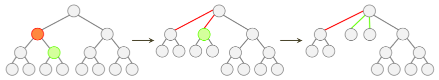

Contractionとは2分木型のBinary BVHを、N分木型のWide BVHへと変換する処理のことをいいます。Collapseという用語を使う場合もあります。プロダクション・レンダラではこの処理を明示的に行うことはなく、直接Wide BVHを構築します。理由は単純で、Binary BVHとWide BVHの両方を保持するメモリが無駄だからです。ただし、構築の過程でContractionの考え方は必要になります。実は奥が深く、やり方次第で出来上がったWide BVHの品質が大きく左右されます。最近では、先述のようにWide BVHの利用がGPUでも効果的であると認められてきているので、覚えておくとよいでしょう。

[Adaptive Collapsing on Bounding Volume Hierarchies for Ray-Tracing](https://paginas.fe.up.pt/~ei06035/paper/adaptive-collapsing-bvh-for-raytracing.pdf)

最適なコントラクションを動的計画法によって求めます。実装がやや面倒になってしまうのが難点です。

[Ray Specialized Contraction on Bounding Volume Hierarchies](https://www.cs.cmu.edu/~ygu1/paper/PG15/conference.pdf)

この方法はBinary BVHをビルドした後、Representative Raysを投げ(実際のレンダリングで使用されるレイの数パーセント程度)、レンダリングを行います。ここではBinary BVHを使用しますが、その際、レイがどのノードをどれだけ訪れたかを記録しておきます。

そのあとコントラクションを行う際には、Representative Raysが多く訪れたノードを優先して展開します。こうすることでSAHではなく実際のシーンにおけるレイの分布に最適化されたWide BVHを作ることができ、それを用いて非常に効率の良いレンダリングができるようになります。個人的には、目からうろこでした。私のレンダラで試したところSponzaでは20％強の高速化が得られました。

[Fragmentation-Aware BVH Contraction](https://github.com/shinjiogaki/reports/blob/master/report.pdf)

Wide BVHの構築の際に、子ノードの数がBVHの幅より小さくなることがあります。一般的には子ノードの数が幅と等しくなるようコスト関数を修正して(例えばオブジェクトの数が４や８の倍数のときボーナスを加えるなど)隙間をなくすようにします。それでも空きのある、リーフだけを含むノードによってメモリが無駄に消費されてしまうことがあります。

このレポートでは、空きスペースのあるノードのペアを見つけて、マージするという簡単な解決策を提案しています。例えばOBVHを利用しているときには、3つ空きがあるノードと５つ空きがあるノードをマージすることによって、無駄なスペースを完全に無くすことが出来ます。パフォーマンスの低下はほぼありません。適当に付けたので、ふさわしい名前かどうかは分かりません。

### 再フィッティング (Refitting)

動いているものを扱うときに、BVHのノードのバウンディング・ボックスが中にあるオブジェクトをきちんと内包していなければ交差判定の結果がおかしくなったり、またルーズにフィットしていると処理に余計な時間がかかります。バウンディング・ボックスをフィットさせる処理自体は非常に簡単ですが、並列化で完全にリニアにスケールさせるのは思いのほか難しいものです。

[Maximizing Parallelism in the Construction of BVHs, Octrees, and k-d Trees](https://research.nvidia.com/publication/maximizing-parallelism-construction-bvhs-octrees-and-k-d-trees)

atomicmin/maxが使える環境であれば、各ノードに親ノードへの参照を持たせることで比較的簡単に並列化できます。

### 部分再構築 (Restructuring)

BVHからツリーレットを切りだしてきて、ツリーレットの末端ノードを一旦リーフとみなし、それらに対してなにかしらの構築のアルゴリズムを適用し、ツリーレットを作り直す操作をRestructuringと呼びます。

既に紹介したLBVHは非常に高速にBVHを構築することができますが、品質自体はあまりよくありません。ですので、この再構築による最適化と組み合わせて品質を上げるといったことが行われます。

[Fast Parallel Construction of High-Quality Bounding Volume Hierarchies](https://research.nvidia.com/publication/fast-parallel-construction-high-quality-bounding-volume-hierarchies)

[(US20140365532A1)](https://patents.google.com/patent/US20140365532A1/en)

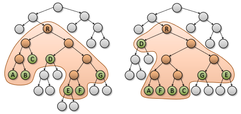

ツリーレットの再構築することで品質を改善します。高速なLVBHで構築したBVHなどと組み合わせて使用されます。

[GPU Optimization of Bounding Volume Hierarchies for Ray Tracing](http://repositorio.unicamp.br/bitstream/REPOSIP/275656/1/Domingues_LeonardoRodrigo_M.pdf)

[(US9817919B2)](https://patents.google.com/patent/US9817919B2/en)

TRBVHでツリーレットの再構築を行う部分にAgglomerative Clusteringを利用したものです。TRBVHよりほんの少し品質が落ちるものの、高速に実行することができます。AACと同様にDistance Matrixを使って最適なノード(ツリーレットにおけるリーフ)の組み合わせを探すという考え方さえ押さえておけばよいでしょう。論文中には、限られたメモリのサイズで効率よくDistance Matrixを更新する方法が書かれています。当然ながら、Agglomerative Clusteringの欠点を引き継ぐので、細かくテッセレーションされたオブジェクトに適用し続けても、交差判定のパフォーマンスは逆に下がってしまうことがあります。

### 回転と再挿入 (Rotation/Reinsertion)

[Tree Rotations for Improving Bounding Volume Hierarchies](https://www.cs.utah.edu/~aek/research/tree.pdf)

[Fast, Effective BVH Updates for Animated Scenes](http://www.cs.utah.edu/~thiago/papers/rotations.pdf)

(image from: https://en.wikipedia.org/wiki/Tree_rotation)

トポロジーを変更するもっとも簡単手法はRotationで、これを一般化したものはReinsertionと呼ばれます。

SAHを下げるようにRotationを行い続けても実際のレイ・トレーシングのパフォーマンスが上がらないことが多いです。これは、先に挙げたEPOからもわかるようにSAH自体がふさわしい尺度でないこと、またこの操作が実際のシーンにおけるレイの分布を考慮していないことなどが原因として考えられます。ツリーがいたずらに深くなるだけといったことも起こります。

[Fast Insertion-Based Optimization of Bounding Volume Hierarchies](http://dcgi.felk.cvut.cz/publications/2013/bittner-cgf-fiobvh)

Reinsertionを導入した最初の論文です。個人的にはRestructuringよりも可能性を感じる方法です。Reinsertionは現状SAHを最も小さくすることができる手法として知られていますが、処理が本質的にはシーケンシャルであるため、最適化にかかる時間がボトルネックとなります。

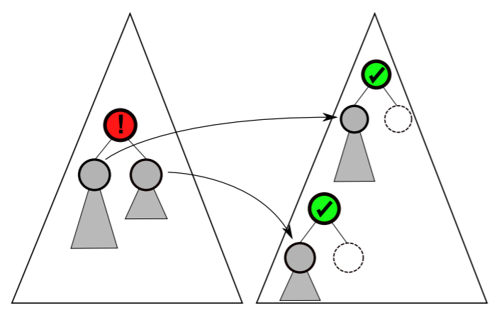

この手法は、一つずつノードを取り除き、その2つの子ノードをコストを最も小さくする場所に移すことで徐々にSAHを小さくしていきます。1つのノードを除いてそれだけをほかの場所に移せばいいのでは？と疑問に思いましたが、2つの子ノードを別の場所に移したほうが少し良い結果が得られたとの記述があります。

削除するノードの選択はランダムでも構いませんが、パフォーマンスを上げるには何かしらの基準が必要となります。具体的には、以下の3つ(node inefficiency measure)をもとにノードを優先的に選択して処理を行うことで収束を早めることができます。

* 表面積が大きい
* 表面積が子ノードの平均表面積に比べて大きい
* 極端に小さな表面積の子ノードを持つ

子ノードの挿入位置は分枝限定法(branch and bound)によって最もSAHが小さくなる場所が選ばれます。

[Incremental BVH construction for ray tracing](https://dl.acm.org/citation.cfm?id=2902855)

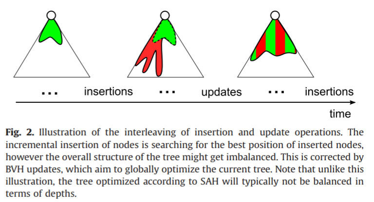

構築方法ですが、説明のつながりからここで紹介します。プリミティブを一つずつ追加し、徐々にBVHを構築していく方法です。単純に追加していくだけであれば構築されるBVHがアンバランスなものになってしまいますが、まとまった数のノードのInsertionとBVHの最適化を交互に行うことで、それを防いでいます。最適化には[Fast Insertion-Based Optimization of Bounding Volume Hierarchies](http://dcgi.felk.cvut.cz/publications/2013/bittner-cgf-fiobvh)の手法が用いられます。

サーバーからクライアントにジオメトリ・データが送られ、クライアント側でインクリメンタルにBVHを構築するアプリケーションが例に挙げられていますが、サーバー側でオブジェクトごとにBVHを構築し、クライアント側で後述のRe-braidingを使ったほうが実装が簡単になるのではないでしょうか。

[Parallel Reinsertion for Bounding Volume Hierarchy Optimization](https://dcgi.felk.cvut.cz/projects/prbvh/prbvh_eg.pdf)

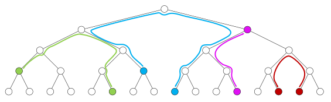

Insertionを並列化することで処理速度と結果のBVHの品質両方を改善する方法です。BVHのトポロジーを変化させるので、並列化する場合にスレッドが衝突しないよう操作中のノードまたはその子や親などロックする必要があります。複数のスレッドが同じ場所に挿入しようとした場合は、最もSAHを小さくするものが優先権を得ます。

論文ではロックの仕方が2つ提案されており、一つはConservative、もうひとつはAggressiveと呼ばれています。Conservativeでは上の図であるようなReinsertionの操作でたどるパス上にあるノードをすべてロックします。Aggressiveではノードの挿入によって実際に変更を受けるノードだけをロックします。また直観に反しますが、Agressiveではシーケンシャルに最適化を行った場合よりも、結果のBVHのSAHをより小さくすることが出来ます。考えてみれば当然なのですが、これは、一つの子孫にあたるノードを取り除いただけでは大して表面積が小さくならなかったノードも、複数を同時に取り除けば表面積が非常に小さくなる場合があり、シーケンシャルの場合よりも最適化のための探索領域が広がるためです。

この論文をしっかり理解すれば先に挙げた2本の論文は特に読む必要はないでしょう。

### 並べ替えとトラバース順序 (Reordering/Traversal Order)

RestructuringとReinsertionはBVHのトポロジーを変えてしまうものですが、Traversal OrderとReorderingはBVHのトポロジーを変えずに処理速度を向上させます。これらは基本的には同じものですが、強いて違いを挙げるならば、Traversal Orderは、どのノードをどういう順で訪れるか、ランタイムでなんらかの計算を行い決定します。Reorderingは構築後一度だけ行えば、トラバース時にオーバーヘッドが発生しない、というのがメリットです。

通常レイ・トレーシングでは一番近いオブジェクトを見つけることが目的であり、Closest-Hitと呼ばれるテストを行います。しかし、影の計算や遮蔽の計算、コリジョン・ディテクションでは何かに当たるということさえ分かれば処理を完了することができるので、交差判定・当たり判定の処理は簡略化することができます。こういったテストはAny-Hitと呼ばれ、子ノードのReorderingによる高速化が可能です。

[SATO: Surface Area Traversal Order for Shadow Ray Tracing](http://gamma.cs.unc.edu/SATO/SATO_files/sato_preprint.pdf)

これはツリーの最適化ではなくトラバースの最適化に関するものです。表面積の大きいノードが影を作ることが多いであろうという前提をもとに、トラバーサルの順番を決めます。もちろんシーン中のライトの位置などが考慮されていないため、常に効果があるわけではなく、状況によっては遅くなることがあります。

[SRDH: Specializing BVH Construction and Traversal Order Using Representative Shadow Ray Sets](http://graphics.cs.cmu.edu/projects/srdh/feltman12_srdh.pdf)

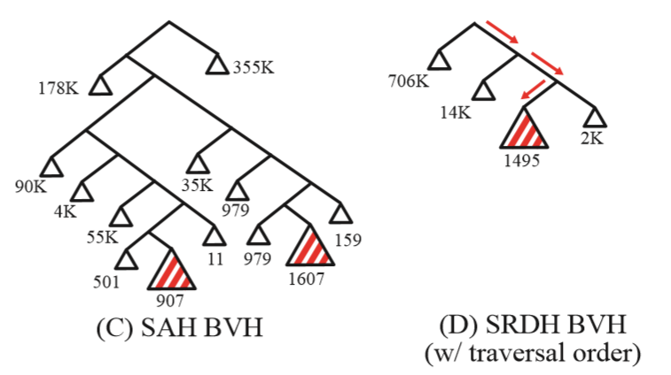

より良い方法は、この論文のようにRepresentative Raysを投げシーンに応じた最適化を行う方法です。

[An N-ary BVH Child Node Sorting Technique for Occlusion Tests](http://jcgt.org/published/0005/02/02/)

SRDHはBinary BVHにのみにしか利用できず、Shadow Ray専用のBVHと通常のBVHを保持するのでメモリを余計に消費します。私が考えた方法では、トラバーサルのコスト関数をWide BVHへと一般化し、最適化をノードの並べ替えのみと限定することで、メモリの消費を抑えます。もう少し分かりやすいタイトルにすべきであったと反省しています。

### Re-braiding

[Improved Two-Level BVHs using Partial Re-Braiding](https://embree.github.io/papers/2017-HPG-openmerge.pdf)

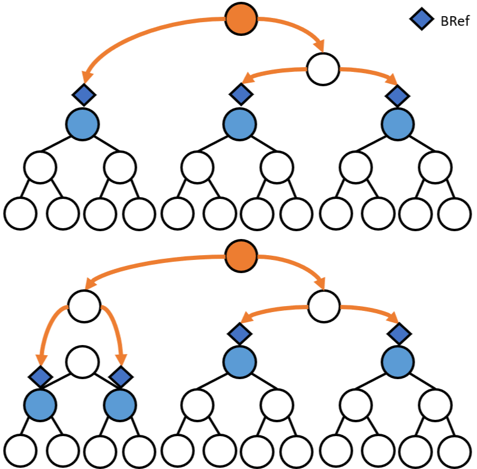

構築時間を短縮したり、アニメーションを簡単にサポートするためにTwo-Level BVHとよばれる2階層のBVHが使われます。これは、同じオブジェクトに所属するプリミティブ、あるいは何かしらの意味を持つプリミティブの集合ごとにBVHを構築し、それらのルートをリーフとみなして、さらに上位の階層のBVHを構築する方法です。

一部のオブジェクトが動く場合などを効率よく扱うことが出来ますが、オブジェクト同士、インスタンス同士がオーバーラップした場合はレイ・トレーシングのパフォーマンスが著しく低下するのは想像に難くないでしょう。

この論文ではRe-braidingと呼ばれるテクニックを用いて、わずかな追加のメモリと構築時間でオブジェクトが重なった場合のパフォーマンスの低下を防ぎます。基本的にはBonsaiで提案された刈込と同様の処理を行います。

    struct Bref
    {
        BVNodeReference ref;
        AABB bounds;
        unsigned int objectID;
        unsigned int numPrims;
    };

Re-braidingではBRefと呼ばれるオブジェクトごとのBVHを参照するデータ構造を使用します。まず、各オブジェクトを参照するBRefを用意します。次に、各Brefが参照しているノードのバウンディング・ボックスがある閾値より大きい場合は、そのBRefを削除し、参照していたノードを刈り込んで、その子ノードを参照するBrefを2つ(Binary BVHの場合は２つ、Wide BVHであれば４や８となります)新たに追加します。この処理BRefが事前に決めた数に達するまで、あるいは刈り込むノードがなくなるまで続けます。最後に、出来上がったBRefをリーフとしてBinningを使い上位レベルのBVHを構築します。

オブジェクトごとのBVHはBinningやSweepで高品質なものを作り、それらには手を加えないところがポイントです。またBRefには、参照しているサブツリーに含まれるプリミティブの数をストアしておきます。そうすることで、上位のBVHを作る際、適切にサブツリーのコストを考慮に入れることが出来ます。複数種類のインスタンスがある場合、それぞれの交差判定にかかるコストは当然違いますから、それらをリーフとして扱う場合には注意が必要です。

`インスタンスはプロダクションのレンダラでは必須の機能ですが、それを扱った論文はそれほど多くありません。Sony Pictures ImageworksのArnoldではシングル・レベルのインスタンシングのみをサポートしています(2018年の執筆時点)。当然マルチレベル・インスタンシングのほうが汎用性が高く、より省メモリで複雑なモデルを扱えますが、セルフ・ヒットを避けるコードや、インスタンスごとに色を変えるシェーダではひと工夫必要になります。`

### 量子化と圧縮 (Quantization/Compression)

BVH自体がレンダリングされるジオメトリに次いで、非常に多くのメモリを消費します。したがって、BVHのノードを圧縮する方法が多数提案されています。

[Memory Efficient Ray Tracing with Hierarchical Mesh Quantization](https://pdfs.semanticscholar.org/c329/a3456cb8ed426472d281bea42320a37a711a.pdf) [(US20110080403A1)](https://patents.google.com/patent/US20110080403A1/en)

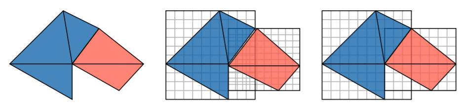

データをQuantize(量子化)するものが一番わかりやすいでしょうか。さらにこの手法ではBVHの中にジオメトリデータをストアします。バウンディング・ボックスの頂点座標を親ノードのバウンディング・ボックスでの相対的な座標で表し、量子化することでメモリを節約します。

さらに、ポリゴンの頂点データなども同様に相対的な座標で表し量子化することで、データ量を大きく削減できます。形が変わってしまうと思うかもしれませんが、BVHが階層的な構造であることを思い出してください。リーフを含むノードは一般的にかなり小さいので、量子化してもそれほど目立つアーティファクトが生じません。

[Compressed-Leaf Bounding Volume Hierarchies](https://embree.github.io/data/compressedleafbvh-hpg-2018-final.pdf)

レイ・トレーシングにおいてはレイとノードとの交差判定が大部分を占め、リーフ・ノードとの交差判定はそこまで多くない、という洞察をもとに、リーフ・ノードのみを圧縮します。

### より良いレイアウト (Better Layouts)

キャッシュ・ミスを減らしたり、消費メモリを減らす様々なレイアウトが提案されています。あまり触れている論文がありませんが、巡回セールスマン問題を用いてレイアウト最適化を行うこともできます。

[Cache-Efficient Layouts of Bounding Volume Hierarchies](http://gamma.cs.unc.edu/COLBVH/)

キャッシュ・ミスを減らすようにノードのレイアウトを変える最適化手法です。

[Implicit Object Space Partitioning: The No-Memory BVH](https://graphics.tu-bs.de/publications/Eisemann11NMH)

プリミティブのIDをうまく並べ替えることによってBVHのトポロジーを表現し、消費メモリを完全に0にする手法です。これはImplicit Object Partitioningと呼ばれ、交差判定はSAH等を用いたトップダウン型によって構築されたBVHと比べ遅くなるものの、メモリが限られた環境では役に立ちます。

原理は簡単です。各ノードは図のように2つのプリミティブのIDによって表現されます。2つのプリミティブはX、Y、Zどれかの軸のSlab(広がり)を表します。幅優先で構築された(左に詰めた)完全2分木型のBVHの場合、ノード(インデックスを$i$とします)の左の子ノードの先頭のプリミティブのIDは$2i+2$、同様に右の場合は$2i+4$として求めることができます。こうすることでAABBのデータと子ノードへの参照が不要になるわけです。

構築時Slabの軸はモートン・コードのように$xyzxyz$とラウンド・ロビンで決めます。メモリを使わないこのようなBVHの品質を上げるという後続の研究がないように思われるので、いろいろ試してみても面白いかもしれません。

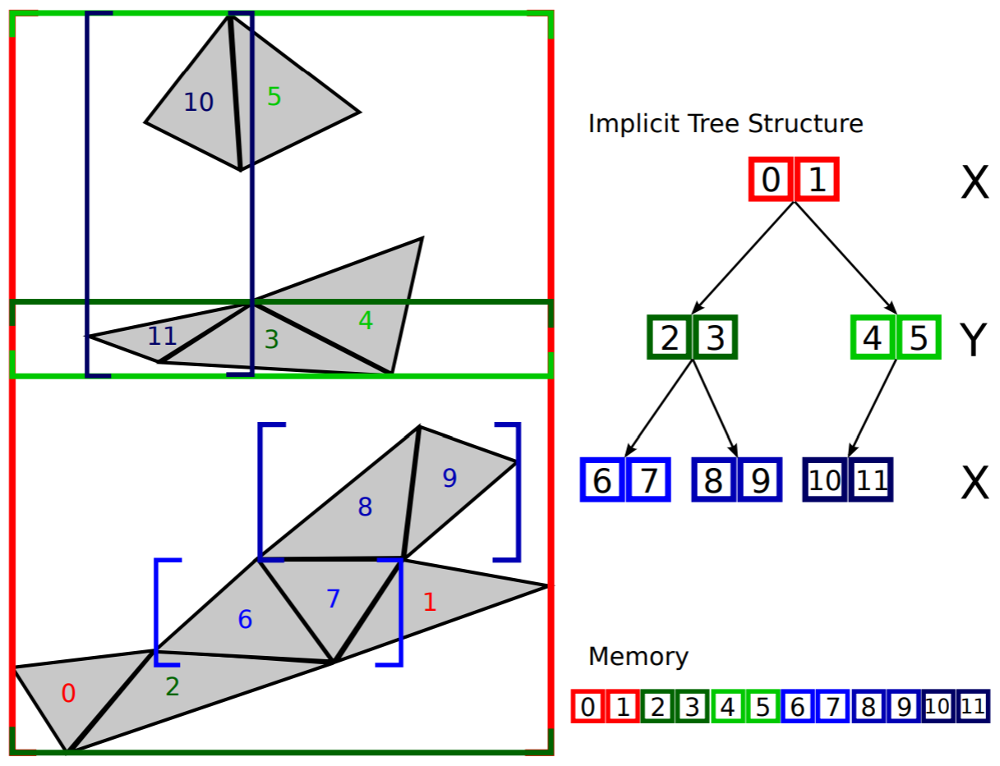

### ハードウェアによるもの (Hardware)

これは理論的な部分ではないので、いくつか論文を羅列するにとどめます。時間ができれば読んで解説を追記したいと思います。

[Fast Hardware Construction and Refitting of Quantized Bounding Volume Hierarchies](https://tutcris.tut.fi/portal/files/11500579/egsr_preprint.pdf)

[PLOCTREE: A FAST, HIGH-QUALITY HARDWARE BVH BUILDER](http://www.tut.fi/vga/publications/PLOCTree_A_Fast_High-Quality_Hardware_BVH_Builder.html)

[MergeTree: A Fast Hardware HLBVH Constructor for Animated Ray Tracing](https://tutcris.tut.fi/portal/files/13191965/paper.pdf)

[Dual Streaming for Hardware-Accelerated Ray Tracing](http://www.cemyuksel.com/research/papers/dual_streaming_hpg2017.pdf)

## プロダクション特有の話題

### アニメーションとモーション・ブラー (Animation/Motion Blur)

BVHがレイ・トレーシングのデータ構造として主流になったのには理由があります。考え方自体が非常に単純でありkd-treeよりロバストであること、またプロダクション・レンダラで必須のモーション・ブラーの実装がしやすい、などが挙げられるでしょうか。

過去RotaionやRefittingの組み合わせでアニメーションに対応する方法が提案されてきました。しかし、これらの手法は多数のCPUコアでスケールさせるのが意外に難しく、プロダクションレンダラではモーション・ブラーが適応されたオブジェクト専用のBVHを構築することが多いです。専用のBVHを利用する場合、メモリの消費が２倍近く、あるいはそれ以上になってしまうので、個人的にはあまり好きではありません。

[T-SAH: Animation Optimized Bounding Volume Hierarchies](http://dcgi.fel.cvut.cz/home/bittner/publications/abvh-eg2015.pdf)

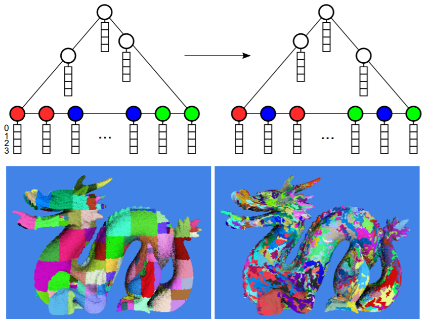

アニメーションに対応するため、SAHを時間軸に拡張したものです。コスト関数はすべてのフレームのSAHコストを重み付き平均したもので、これを最小化するようにReinsertionによる最適化を行い、単一のBVHをすべてのフレームに使用します。

ノードを取り除いて最適な場所に挿入しますが、どのノードを選択するかによって、パフォーマンスは大きく変わります。バウンディング・ボックスの表面積を時間軸で積分した値に比例して選ぶのが良いですが、Metropolis-Hastingサンプリングによってインポータンス・サンプリングを行います。前回選んだものと同じノードが選ぶのは効率が良くないので、違うノードが選ばれた時だけアクセプトします。よって、選ばれたノードのサンプルは完全に積分値の分布に従うわけではありません。

また、1つのノードを挿入して重みを更新するのは効率が悪いのである程度のノードをまとめて処理したのち、重みを一気に更新します。論文では、このバッチのサイズは、BVHで使われているノード数の2％としています。

[Sony Pictures Imageworks Arnold](https://fpsunflower.github.io/ckulla/data/2018_tog_spi_arnold.pdf)

モーションブラー用のBVHはこちらの文献にあるように、各ノードがモーションパスの両端に相当する２つのバウンディング・ボックスを持っています。交差判定中はそれらが適宜線形補間されます。

[Arnold: A Brute-Force Production Path Tracer](https://www.solidangle.com/research/Arnold_TOG2018.pdf)

当然といえば当然ですが、Solid AngleのArnoldも同じアプローチです。

[MSBVH: An Efficient Acceleration Data Structure for Ray Traced Motion Blur](http://gruenschloss.org/msbvh/msbvh.pdf)

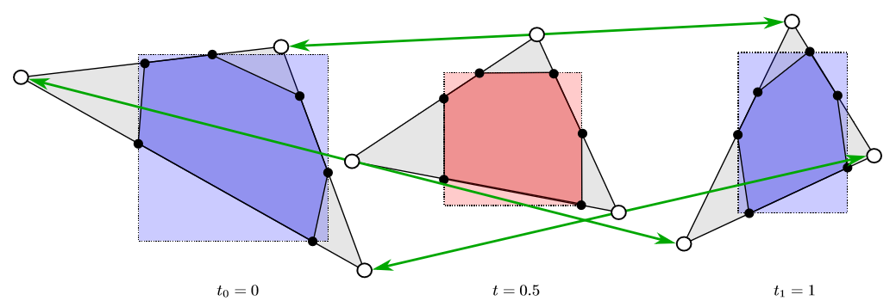

Spatial Splitsを使って構築した場合はプリミティブ(厳密にはその参照)が複製され、複数の別のノードから同じプリミティブが参照されます。プリミティブが１つのノードのバウンディング・ボックスだけに収まらず、複数にまたがるためです。言い換えれば、一つのプリミティブへの参照が複製されます。静的なシーンであればこの扱いはそれほど難しくはないのですが、モーション・ブラーが関わってくると厄介です。

この論文ではSplitsを使いながらもノードの重なりを減らす方法を提案しています。

はじめに、時間を$t=0.5, (0<=t<=1)$で固定してSBVHを構築し、BVHのトポロジーを決定します。ポリゴンはSplit(切断)されるため、バウンディング・ボックスとポリゴンの交点を求める必要がありますが、それらを重心座標系で保持しておくと、モーション・セグメントの両端点($t=0.0$と$t=1.0$)での座標も容易に求めることができます。両端でのバウンディング・ボックスは両端での交点を全て含むようフィットさせます。この両端でのバウンディング・ボックスはクリッピング・ボックスと呼ばれます。$0<t<1$では２つのクリッピング・ボックスを補間し、それを用いて交差判定を行います。

バウンディング・ボックスの重なりが完全になくなるのではありませんが、Spatial Splitsを使用したBVHでもモーション・ブラーを効率よく扱えるようになります。

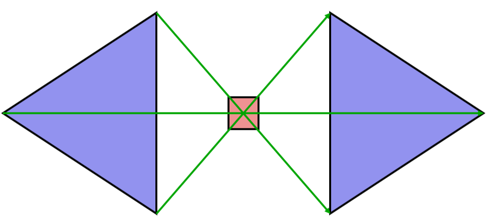

この手法には考えられる欠点が２つあります。一つ目は、図のように$t=0.5$の時にポリゴンが縮退する場合、Clippingがロバストにできないであろうということ、二つ目は、前述のように$0<t<1$ではクリッピング・ボックスを補間しますが、t=0.5付近では補間されたバウンディング・ボックスがタイトにフィットしないということです。実際あまり起きないのではと思うかもしれませんが、モーション・グラフィックスなどでの使用も考えると、不安要素は取り除いておきたいものです。

[STBVH: A Spatial-Temporal BVH for Efficient Multi-Segment Motion Blur](https://embree.github.io/papers/2017-HPG-msmblur.pdf) [(US9430863B1)](https://patents.google.com/patent/US9430863)

モーション・セグメントが１つではなく、複数の場合へと拡張しています。構築の際には、プリミティブを時間軸でグループ分けするか、オブジェクト単位でグループ分けするか、交差判定の負荷が小さくなるように決定します。T-SAHではバウンディング・ボックスの再フィッティングが必要ですが、この手法では必要ありません。

### 誤差 (Robustness)

[Robust BVH Ray Traversal](http://jcgt.org/published/0002/02/02/)

交差判定の誤差は厄介な問題です。BVHはkd-treeに比べロバストですが、それでも問題が生じます。この論文ではその原因と対応策について述べています。

## 課題 (Open Problems)

非常に多くの研究が行われてきていますが、まだまだ答えのはっきりしない問題がたくさんあります。研究テーマとして挙げておきます。

### 複数種類のプリミティブ

いろいろな種類のプリミティブ、カーブやポリゴン、パーティクルなどをどう扱うかというのはなかなか難しい問題です。一種類のプリミティブだけを扱うBVHを複数構築するのがよいか、すべてのオブジェクトを一緒に扱って一つのBVHを作るか選択肢は2つありますが、それぞれに長所短所があります。

[Exploiting Local Orientation Similarity for Efficient Ray Traversal of Hair and Fur](https://projet.liris.cnrs.fr/m2disco/pub/Congres/2014-HPG/2%20Ray%20Tracing/2%20Exploiting%20Local%20Orientation%20Similarity%20for%20Efficient%20Ray%20Traversal%20of%20Hair%20and%20Fur.pdf)

この論文では、毛をうまく扱うために、毛の向きに沿うようバウンディングボックスをトランスフォームするという方法が提案されています。しかし、行列をストアするので追加で必要となるメモリが問題となってきます。また、過度にカールした髪の毛の扱いも厄介です。

### 目的別のBVH

現状、一般的には目的別(交差判定、衝突判定、照明計算)のBVHが用意されます。用途の数を$O$、プリミティブの種類を$P$、さらに静的・動的の組み合わせを考えると$2 \times O \times P$のBVHを管理しなければならず、非常に厄介です。どのようにすれば万能なBVHをつくることができるでしょうか？個人的にはこの研究をしたいと思います。最近ではLight Transportでも使われるようですし、複雑さは増していく一方です。

### Wide BVHの最適化

ここで取り上げた最適化手法はReorderingを除いてWide BVHにそのまま使えないもの、あるいは組み合わせの爆発で使用が現実的でないものばかりです。また最適化はEPOや、シーン内におけるレイの分布を考慮に入れて行うべきですが、それらを見積もるにもコスト(時間とメモリ)がかかるので、SAHを減らすように最適化を行うものが主流となっています。

### 他分野での利用

レンダリングでは3次元のBVHが主に使われますが、次元を上げたり下げたりすれば、この記事で取り上げたテクニックは、データベース等の全く別の分野で使えると思います。

## さいごに

様々な手法を紹介しましたが、いかがだったでしょうか？私の主観が入ったコメントが多くなりましたが、長年やってきて正しいと思うことを述べるように努めました。論文は紹介した以外にもまだまだありますので、後日追記したいと思います。また、知っていることを全て書いたわけでもありませんが(研究に取っておきたいアイデアや仕事を通じて知ったこと等書けないこともあります)、この記事がBVHに興味を持ってもらえるきっかけとなれば幸いです。また、BVHよりもさらに優れたデータ構造が存在することも十分考えられますので、固定観念にとらわれず、いろいろなアイデアを自由に試してみてください。

一緒に研究したいという方、学校などで話して欲しいという方は[ご連絡](https://twitter.com/ShinjiOgaki)ください。
